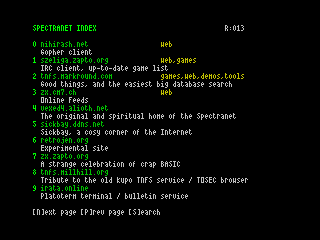

# Spectranet Search Index

Decentralised TNFS index Spectranet module for ZX Spectrum.



## How to install?

Type the following:
```
%mount 0,"boot.speccytools.org"
%load""
(reboot)
! <hit enter>
```

## How does it work?

It uses DNS (TXT) records of several indexes.

```text
;; QUESTION SECTION:
;index.speccytools.org.		IN	TXT

;; ANSWER SECTION:
index.speccytools.org.	93	IN	TXT	"type=tnfs;host=nihirash.net;title=Gopher client;tags=web"
index.speccytools.org.	93	IN	TXT	"type=tnfs;host=szeliga.zapto.org;title=IRC client, up-to-date game list;tags=web,games"
index.speccytools.org.	93	IN	TXT	"type=tnfs;host=tnfs.markround.com;title=Good things, and the easiest big database search;tags=games,web,demos,tools"
index.speccytools.org.	93	IN	TXT	"type=tnfs;host=zx.cm7.ch;title=Online Feeds;tags=web"
index.speccytools.org.	93	IN	TXT	"type=tnfs;host=vexed4.alioth.net;title=The original and spiritual home of the Spectranet"
index.speccytools.org.	93	IN	TXT	"type=tnfs;host=sickbay.ddns.net;title=Sickbay, a cosy corner of the Internet"
index.speccytools.org.	93	IN	TXT	"type=tnfs;host=retrojen.org;title=Experimental site"
index.speccytools.org.	93	IN	TXT	"type=version;host=boot.speccytools.org;title=0.1"
index.speccytools.org.	93	IN	TXT	"type=tnfs;host=zx.zapto.org;title=A strange celebration of crap BASIC"
index.speccytools.org.	93	IN	TXT	"type=tnfs;host=tnfs.millhill.org;title=Tribute to the old Kupo TNFS service / TOSEC browser"
index.speccytools.org.	93	IN	TXT	"type=tnfs;host=irata.online;title=Platoterm terminal / bulletin service"
index.speccytools.org.	93	IN	TXT	"type=tnfs;host=zx.desertkun.in;title=ZX Spectrum browser for forums and imageboards;tags=web"
index.speccytools.org.	93	IN	TXT	"type=tnfs;host=tnfs.bytedelight.com;title=Everything for your ZX Spectrum;tags=tools"
index.speccytools.org.	93	IN	TXT	"type=index;host=index2.speccytools.org"
```

The index has several TXT records assigned to the same index domain.
Every record follows simple `key=value;key2=value` format.

The following types are supported:
1. `tnfs` describe a TNFS resource. `title` for resource description, `host` for its mount point, `tags` for resource tags.
2. `index` a reference to another index which is recursively called, ideally, maintained by different party.

One index can refer to another one, thus providing a way to maintain a list of TNFS resources
by several independent parties.